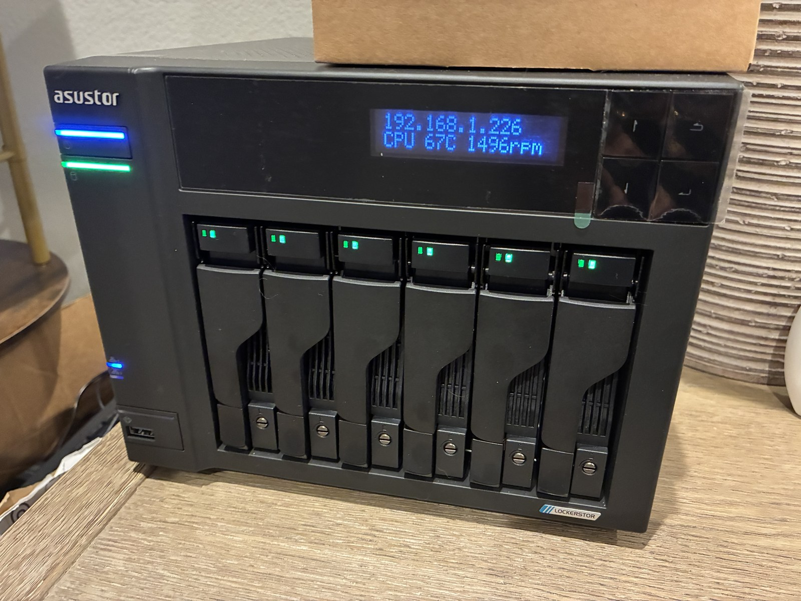

# unraid-as6706t-localbootconfig

Custom **boot-time scripts** for an **Unraid** server running on **Asustor
Lockerstor 6 Gen 2 (AS6706T)** hardware, plus background docs.

These are the hardware-specific customizations that aren't part of stock Unraid —
a custom fan controller, the front-panel LCD/LED scripts, and the kernel-module
tweak that makes them possible — kept here so that after a reinstall I can put
them back deliberately and understand *why* each one exists.

> ## Status
>
> Published as a personal homelab reference, not an actively maintained product.
> Issues and PRs are welcome but won't get fast turnaround. The [`docs/`](docs/)
> tree and the scripts under [`boot/config/scripts/`](boot/config/scripts/) are
> the parts most likely to be useful to others — but everything here is tuned for
> **one specific machine**, so read the [scope & disclaimer](#scope--disclaimer)
> (especially about fan curves) before reusing it on your own hardware.

> **Scope:** this repo is intentionally limited to **portable, hardware-specific
> scripts**. It deliberately does **not** include anything specific to one
> server's setup — no shares, users, array/disk assignment, pools, network, or
> GUI preferences. Those are reconfigured through the Unraid GUI, not restored
> from here.
>
> **Host it was captured from:** Unraid 7.3.1 on an Intel Celeron N5105 AS6706T.

## Why this exists

Unraid runs entirely from a **RAM root** that is rebuilt on every boot. The only
storage that persists *and* is available early in boot is the USB flash drive,
mounted at `/boot`, and specifically **`/boot/config/`**. So any custom script —
the fan controller, the LCD daemon, the LED tweak — has to live under
`/boot/config` and be wired in through the `/boot/config/go` boot script, or it
vanishes on reboot.

If the USB stick dies or I reinstall, those customizations are gone unless
they're backed up. This repo is that backup.

👉 Start here: [`docs/unraid-boot-and-persistence.md`](docs/unraid-boot-and-persistence.md)

## What's in here

The `boot/config/` tree **mirrors the layout on the NAS** so files map 1:1 back
to where they belong:

```
boot/config/
├── go                         # boot hook: installs + starts the scripts below, disables the LED
├── modprobe.d/
│   └── it87.conf              # blacklist mainline it87 so the Asustor driver owns the chip
├── scripts/
│   ├── fan-autocontrol.sh     # ★ custom multi-sensor fan controller
│   ├── asustor-lcd.sh         # low-level front-panel LCD writer (LCM serial protocol)
│   ├── lcd-info.sh            # LCD daemon: live IP + CPU temp + fan RPM
│   ├── disk-led.sh            # per-bay disk-activity LED daemon (lifecycle/control)
│   ├── disk-led.pl            #   └─ its GPIO-chardev engine (pure Perl, no deps)
│   ├── power-schedule.sh      # opt-in: scheduled power-off + RTC self-wake engine (off by default)
│   ├── power-schedule.conf.example  #   └─ site config template (live conf is gitignored)
│   └── claude-persist.sh      # keep the Claude Code CLI alive across reboots
└── claude/conf/
    └── settings.json          # Claude CLI settings (theme only; secrets excluded)
```

★ = the headline customization.

## Requirements

These scripts have **one external dependency**: the **Asustor Platform Drivers**
Unraid plugin. It is the *only* Unraid app/plugin you need to install, and it's a
hard prerequisite — it loads the kernel drivers that expose the **IT8625** fan
chip (`pwm1` / `fan1_input`), the front-panel **LEDs**, and the **LCD** that the
fan, LCD, and LED-off scripts all talk to.

- **Install it** from Unraid's **Community Applications** (search *"Asustor
  Platform Drivers"*), then **reboot**.
- **Driver source:** <https://github.com/mafredri/asustor-platform-driver>
  (packaged as the Unraid plugin by
  [Terebi42/unraid-asustor-pfd](https://github.com/Terebi42/unraid-asustor-pfd)).

Without it, `fan-autocontrol.sh status` reports *"it8625 pwm not found"* and the
LCD/LED scripts have no hardware to drive. The `it87` blacklist
([`modprobe.d/it87.conf`](boot/config/modprobe.d/it87.conf)) is included so this
Asustor driver — not the generic mainline `it87` — owns the chip. Full details in
[asustor-platform-driver.md](docs/asustor-platform-driver.md).

> `claude-persist.sh` is the exception — it's pure filesystem/symlink work and
> does **not** need the Asustor plugin.

## The customizations, briefly

| Customization | What / why | Docs |
| ------------- | ---------- | ---- |
| **Custom fan control** | A dependency-free bash daemon that drives the single AS6706T fan from a *blend* of CPU + NVMe + HDD temps (highest-wins, smoothed, spin-down aware). Replaces Dynamix Auto Fan Control, which is HDD-temp-only. | [fan-control.md](docs/fan-control.md) |
| **Front-panel LCD** | Shows live IP / CPU temp / fan RPM on the front LCD. | [front-panel-lcd.md](docs/front-panel-lcd.md) |
| **Per-bay disk-activity LEDs** | Lights the six green front-bay LEDs from real disk activity — Unraid's kernel omits `CONFIG_LEDS_GPIO` + the disk-activity trigger, so a pure-Perl daemon drives the GPIO lines and emulates it from `/proc/diskstats`. The same daemon also drives the front-panel green **status** LED — **NVMe**-activity flicker by default, or forced off/solid (the M.2 slots have no LED of their own). | [disk-leds.md](docs/disk-leds.md) · [nvme-activity-led.md](docs/nvme-activity-led.md) |
| **Per-bay red / fault LEDs** | The same daemon lights a bay **solid red** when Unraid disables that disk (`DISK_DSBL`), suppressing its green flicker — mirroring how ADM marks a failed tray. Reads `disks.ini`/`var.ini` on a slow poll, gated on `mdState="STARTED"`; strict 2-state (no amber). | [disk-fault-leds.md](docs/disk-fault-leds.md) |
| **Scheduled power-off + RTC self-wake** *(opt-in)* | A general engine that lets a secondary/offsite NAS power itself **off** when idle and **wake itself** via the CMOS RTC alarm for its backup window — always re-arming the next wake first so it can't strand itself. Selectable wake times and power-off modes (`idle` / `fixed` / external). **Ships inert** (`ENABLED=0`, not started from `go`); the per-machine schedule lives in a gitignored config. | [power-schedule.md](docs/power-schedule.md) |
| **Asustor platform driver** | The community plugin + the `it87` blacklist that provide `asustor_it87` (the IT8625 fan/PWM chip), LEDs, and LCD — the foundation everything else builds on. | [asustor-platform-driver.md](docs/asustor-platform-driver.md) |
| **Claude CLI persistence** | Keeps the Claude Code CLI (binary + login + settings) alive across Unraid's RAM-root reboots via a store on `/boot` + symlinks. | [claude-cli-persistence.md](docs/claude-cli-persistence.md) |

## Documentation

| Doc | Topic |
| --- | ----- |
| [unraid-boot-and-persistence.md](docs/unraid-boot-and-persistence.md) | **read first** — how Unraid boots from RAM and what actually persists |
| [hardware.md](docs/hardware.md) | the AS6706T: N5105, the IT8625 chip, sensors, front panel |
| [asustor-platform-driver.md](docs/asustor-platform-driver.md) | the `asustorpfd` plugin + the `it87` blacklist (prerequisite for the scripts) |
| [fan-control.md](docs/fan-control.md) | the custom fan controller in depth |
| [front-panel-lcd.md](docs/front-panel-lcd.md) | the LCD scripts + the status-LED tweak |
| [disk-leds.md](docs/disk-leds.md) | the per-bay disk-activity LED daemon (and why it's Perl) |
| [disk-fault-leds.md](docs/disk-fault-leds.md) | per-bay red/fault LEDs from Unraid disk state (same daemon) |
| [nvme-activity-led.md](docs/nvme-activity-led.md) | NVMe activity on the front-panel green status LED (same daemon) |
| [power-schedule.md](docs/power-schedule.md) | scheduled power-off + RTC self-wake for the offsite backup window |
| [claude-cli-persistence.md](docs/claude-cli-persistence.md) | persisting the Claude Code CLI |
| [restore-guide.md](docs/restore-guide.md) | **how to redeploy these scripts after a reinstall** |

## Scope / disclaimer

These scripts target the **AS6706T** under **Unraid 7.3.1**. I used the Claude
Code CLI to help probe *my specific hardware* — identifying the correct hwmon
temperature sensors (`coretemp`, `nvme`, `drivetemp`, the `it8625` fan chip) and
working out fan curves that suit this box's CPU, NVMe, and disks.

**Verify everything against your own hardware before relying on it.** Sensor
names, the fan-control chip, and safe temperature ranges differ between models,
firmware revisions, and disk sets. This is doubly true for the **cooling fan
curves** — wrong `MIN/MAX` temperatures or PWM floors can leave a component
running too hot. Confirm your own sensors (e.g. `sensors`, `cat
/sys/class/hwmon/*/name`), re-tune the curves in
[`fan-autocontrol.sh`](boot/config/scripts/fan-autocontrol.sh), and watch
`fan-autocontrol.sh status` under load before trusting it unattended.

Nothing here is affiliated with or endorsed by Asustor or Unraid.

## License

Released under the [MIT License](LICENSE).

## Acknowledgements

This project was developed with the assistance of AI tools.

## The hardware



The AS6706T running Unraid with these scripts enabled — the front-panel LCD and
the status/fault LEDs are driven by the daemons in this repo.
